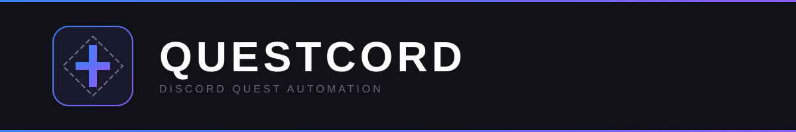
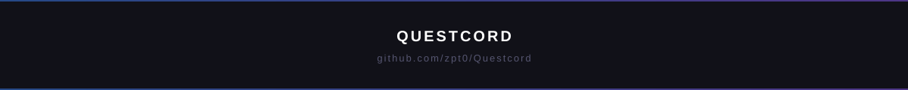

<p align="center">
  
</p>

<p align="center">
  <strong>A <a href="https://github.com/Vendicated/Vencord">Vencord</a> plugin that automates Discord Quests with real-time progress tracking.</strong>
</p>

<p align="center">
  <a href="https://github.com/zpt0/Questcord/actions/workflows/ci.yml">
    
  </a>
  <a href="https://github.com/zpt0/Questcord/releases">
    
  </a>
  <a href="https://github.com/zpt0/Questcord/blob/main/LICENSE">
    
  </a>
  <a href="https://discord.gg/MKU8zvHBBJ">
    
  </a>
</p>

---

<p align="center">
  <strong>⚠️ Disclaimer:</strong> This project is for educational purposes only. Using this plugin may violate Discord's <a href="https://discord.com/terms">Terms of Service</a> and <a href="https://discord.com/guidelines">Community Guidelines</a>, which can result in permanent account termination. Use at your own risk.
</p>

---

<h2 align="center">Features</h2>

<table align="center">
  <tr>
    <td align="center">
      
      <br/>
      <strong>Activity Quests</strong><br/>
      <sub>Auto-play activities</sub>
    </td>
    <td align="center">
      
      <br/>
      <strong>Stream Quests</strong><br/>
      <sub>Watch streams</sub>
    </td>
    <td align="center">
      
      <br/>
      <strong>Video Quests</strong><br/>
      <sub>Watch videos</sub>
    </td>
    <td align="center">
      
      <br/>
      <strong>Play Quests</strong><br/>
      <sub>Play games</sub>
    </td>
    <td align="center">
      
      <br/>
      <strong>Progress</strong><br/>
      <sub>Real-time tracking</sub>
    </td>
  </tr>
</table>

<h2 align="center">Installation</h2>

<table align="center"><tr><td>

```bash
cd path/to/Vencord/src/userplugins
git clone https://github.com/zpt0/Questcord.git
```

</td></tr></table>

<p align="center">Rebuild Vencord, restart Discord, and enable <strong>Questcord</strong> in <code>Settings > Vencord > Plugins</code>.</p>

<h2 align="center">Usage</h2>

<p align="center">Enable the plugin → Quests auto-complete in the background → track progress in real-time.</p>

<h2 align="center">Contributing</h2>

<p align="center">See <a href="CONTRIBUTING.md">CONTRIBUTING.md</a> for setup instructions and guidelines.</p>

<p align="center">
  <a href="https://github.com/zpt0/Questcord/graphs/contributors">
    
  </a>
</p>

<h2 align="center">Support</h2>

<p align="center">
  <a href="https://github.com/zpt0/Questcord/issues/new?template=bug_report.yml">Report a Bug</a> ·
  <a href="https://github.com/zpt0/Questcord/issues/new?template=feature_request.yml">Request a Feature</a> ·
  <a href="https://discord.gg/MKU8zvHBBJ">Discord Server</a>
</p>

---

<p align="center">
  <sub>Made with ❤️ by <a href="https://github.com/zpt0">zpt0</a></sub>
</p>

<p align="center">
  
</p>
